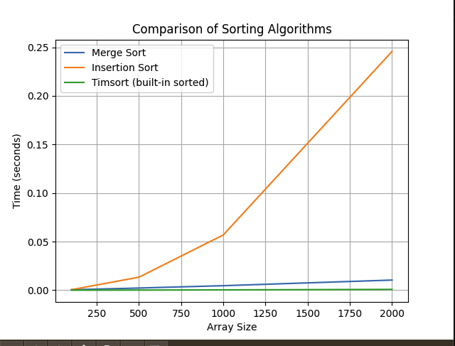

# Порівняння алгоритмів сортування в Python

У цьому проєкті емпірично порівнюються три алгоритми сортування:

- Merge Sort (сортування злиттям)
- Insertion Sort (сортування вставками)
- Timsort (вбудований алгоритм Python — `sorted()`)

---

## Складність алгоритмів

| Алгоритм        | Теоретична складність | Найгірший випадок |
|-----------------|------------------------|-------------------|
| Merge Sort      | O(n log n)             | O(n log n)        |
| Insertion Sort  | O(n²)                  | O(n²)             |
| Timsort         | O(n log n)             | O(n log n)        |

---

## Результати експерименту

| Розмір масиву | Merge Sort | Insertion Sort | Timsort (sorted) |
|---------------|------------|----------------|------------------|
| 100           | 0.000388   | 0.000506       | 0.000020         |
| 500           | 0.002157   | 0.012492       | 0.000130         |
| 1000          | 0.004709   | 0.059697       | 0.000289         |
| 2000          | 0.010478   | 0.257251       | 0.000700         |

---

## Візуалізація

Графік демонструє, як час виконання алгоритмів змінюється зі збільшенням розміру масиву:

- Insertion Sort — повільний при великих обсягах даних.
- Merge Sort — стабільний та ефективний.
- Timsort — найшвидший у всіх тестах.

---

## Висновки

- **Timsort** (вбудований `sorted`) демонструє найкращу продуктивність завдяки комбінації **сортування злиттям і вставками**.
- **Merge Sort** ефективний, але повільніший за Timsort.
- **Insertion Sort** — простий, але не підходить для великих масивів.

🟩 **Timsort об’єднує переваги двох підходів, адаптуючись до частково відсортованих даних, що робить його надзвичайно ефективним у реальних задачах.**
